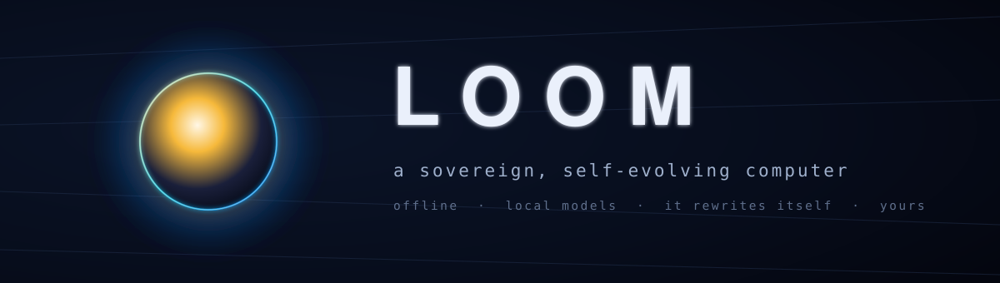

<div align="center">



&nbsp;


<a href="LICENSE"></a>

<br/>


&nbsp;

<a href="#what-this-is"><kbd> &nbsp; <b>What this is</b> &nbsp; </kbd></a> &nbsp;
<a href="#the-fleet"><kbd> &nbsp; <b>The fleet</b> &nbsp; </kbd></a> &nbsp;
<a href="#how-it-weaves-itself"><kbd> &nbsp; <b>How it weaves itself</b> &nbsp; </kbd></a> &nbsp;
<a href="#architecture"><kbd> &nbsp; <b>Architecture</b> &nbsp; </kbd></a> &nbsp;
<a href="#quickstart"><kbd> &nbsp; <b>Quickstart</b> &nbsp; </kbd></a> &nbsp;
<a href="#roadmap"><kbd> &nbsp; <b>Roadmap</b> &nbsp; </kbd></a>

</div>

---

## What this is

A *loom* weaves loose thread into cloth. To *loom* is also to rise into view — a presence gathering on the horizon. **LOOM is both: a computer that weaves itself into being, and grows into a presence you live beside.**

You describe a capability in a sentence. LOOM plans it, writes the code, validates it, tests it, and grows a new **organ** for itself — **fully offline, no cloud, no subscription, versioned so nothing is ever lost.** It is a **companion + workspace**: a presence you talk to, and a growing desktop of tools it built for you. The grid goes down and it still evolves. You own it, and it becomes whatever you need — forever.

> *You shouldn't rent your tools from the cloud. You should own one thing that becomes whatever you need.*

This is the generalization of a proven idea. Its predecessor — the **Forge** engine inside [EMBER](https://github.com/AllStreets) — already showed a local model can build and maintain real software offline **and verify its own work** (self-test: **21/21**, replicable). LOOM makes that engine the *heart*, not a hidden feature.

```
  the instrument
  ├─ the orb ......... a breathing, oracle-light presence — listens, thinks, speaks   ⟢ roadmap
  ├─ the companion ... talk or type; it acts, or it builds                             ⟢ roadmap
  ├─ organs .......... self-built tools — isolated, hot-loaded, freely rewritten       ⟢ roadmap
  ├─ the loom ........ the self-editing engine — plan · edit · validate · self-test    ⟢ roadmap (Forge-proven)
  ├─ the fleet ....... 3 local models, resident, no swapping                           ✓ live
  ├─ the timeline .... every change a git commit — branch, diff, one-click rollback    ✓ live
  └─ safe-boot ....... a bad edit can never strand you                                 ◔ scaffolded
```

---

## The fleet

Three models, **resident at once on 64GB** (~34GB, pinned) — no swapping, each a specialist. Fully local via [Ollama](https://ollama.com); a slow or absent model **times out, retries once, then falls back** — it never hangs the UI.

| role | model | Ollama tag | ~RAM | why |
|---|---|---|---|---|
| **Builder** — writes LOOM's own code | Qwen3-Coder-30B-A3B | `qwen3-coder:30b-a3b-q4_K_M` | 19 GB | MoE, 3B active → fast; 256K context |
| **Companion** — the always-on presence | gpt-oss-20b | `gpt-oss:20b` | 14 GB | quick, adjustable reasoning depth |
| **Rewriter** — the prompt compiler | Qwen3-1.7B | `qwen3:1.7b` | 1.4 GB | sub-second; restructures your words for the model |

*Max-quality builder, on demand:* `qwen3-coder-next` (80B-A3B) when a build is hard. Genuinely frontier open models are cloud-only and won't fit 64GB — this is the local ceiling, and it's enough.

---

## How it weaves itself

LOOM never asks a local model to reproduce a whole file — that's where self-editing breaks. Every change is decomposed so the model's **output stays tiny**, then gated before it can ever touch what's live:

```
  a sentence
     │
     ▼   the prompt compiler — deterministic, cheap: normalize → classify intent →
     │   extract slots → fill a versioned template in the model's exact chat format
     ▼
  the plan ── ordered steps, each one file, one focused change
     │
     ▼   the smallest edit that does the job:
     │     · append-mode ...... splice new entries into a data array (~1KB out)
     │     · edit-blocks ...... SEARCH/REPLACE one region (any file type)
     │     · full write ....... only for brand-new files
     ▼
  the gate ── syntax · runtime smoke-test (in a sandbox) · shell-guard
     │        it can't drop a core script, can't ship code that crashes on render
     ▼
  the timeline ── build on a branch → self-test → merge live → one-click rollback
```

This is the engine being ported from EMBER's Forge, hardened: git-backed history instead of backup folders, sandboxed validation instead of main-thread `eval`, a self-test suite in CI from day one.

---

## Architecture

A small **protected kernel** hosts a **growing body of organs**, with a companion that talks to it and a loom that weaves it — everything recorded so nothing is ever lost.

```
┌──────────────────────────── LOOM.app (Tauri v2) ────────────────────────────┐
│  KERNEL  — React + Vite, built, protected (gorgeous)                         │
│  ├─ the orb + living UI ...... react-three-fiber · breathing · oracle-light  │  ⟢
│  ├─ the companion ........... talk / type → act · build · converse           │  ⟢
│  ├─ the prompt compiler ..... your words → a perfect model-specific prompt   │  ⟢
│  ├─ the loom ................ plan · append/edit-block · validate · self-test │  ⟢
│  ├─ the organ host .......... registry · router · per-organ error boundary   │  ⟢
│  ├─ the timeline ............ git history · diff · rollback                   │  ✓
│  └─ safe-boot ............... recovery shell if the kernel ever fails to load │  ◔
│                                                                              │
│  ORGANS  — no-build modules, freely self-edited, hot-loaded, isolated        │  ⟢
│                                                                              │
│  RUST CORE                                                                   │
│  ├─ fleet manager (Ollama) .. resident · keep-alive · timeout · fallback     │  ✓
│  ├─ git Timeline (git2) ..... commit · log · rollback · last-good            │  ✓
│  ├─ whisper.cpp (STT) · piper (TTS) .. offline voice                         │  ⟢
│  └─ sandbox host ............ runs organ smoke-tests off the main thread     │  ⟢
└──────────────────────────────────────────────────────────────────────────────┘
                          Ollama (local) ── 3-model fleet
    ✓ live in this repo   ◔ scaffolded   ⟢ next, on the roadmap
```

The kernel/organ split is load-bearing: the kernel is *built* and protected (gated self-modification in v1); organs are *no-build* modules the loom rewrites freely. Full self-modification — LOOM editing its own kernel — is a deliberate later flip of that guardrail, not a rebuild.

---

## Quickstart

> **Prerequisites:** [Node](https://nodejs.org) 20+, the [Rust toolchain](https://rustup.rs), and [Ollama](https://ollama.com). Everything runs on your machine — no keys, no accounts, no network.

```bash
git clone https://github.com/AllStreets/loom.git
cd loom && npm install

# pull the local fleet (once; ~35GB — the app runs without them, the fleet just shows offline)
ollama pull qwen3-coder:30b-a3b-q4_K_M   # builder
ollama pull gpt-oss:20b                  # companion
ollama pull qwen3:1.7b                   # rewriter

npm run check      # gate: vitest + cargo test  (foundation: 4 + 7 green)
npm run tauri dev  # open LOOM
```

The window opens to the console: the fleet lights up green as each model loads, and the Timeline records every change LOOM makes to itself.

---

## Roadmap

Built in phases, each a working, tested milestone. **Phase 1 is in this repo.**

| phase | what | status |
|---|---|---|
| **1 · Foundation** | Tauri shell · Rust core · local fleet manager · git Timeline · status surface · CI | ✓ **shipped** |
| **2 · The Loom** | port + harden Forge: plan · append/edit-blocks · steps · sandboxed validation · self-test | next |
| **3 · Companion + organs** | prompt compiler · the presence (text) · seed organs · the organ host | next |
| **4 · The orb + living UI** | react-three-fiber oracle-light orb · breathing motion · the living dashboard | next |
| **5 · Voice** | offline whisper.cpp + piper · push-to-talk · a voice loop that never half-works | next |
| **later** | the OS-like windowed desktop · full self-modification (kernel included) | vision |

Design record: [`docs/superpowers/specs`](docs/superpowers/specs) · plans: [`docs/superpowers/plans`](docs/superpowers/plans) · tracked follow-ups: [`docs/FOLLOWUPS.md`](docs/FOLLOWUPS.md).

---

## Principles

- **Sovereign.** It runs on your machine, off the grid, forever. No cloud, no subscription, no telemetry, no wall.
- **Self-verifying before impressive.** Nothing goes live until it passes syntax, a runtime smoke-test, and its own tests. A bad edit is caught, not shipped.
- **It can't strand you.** Every change is a git commit; a broken kernel boots into recovery and rolls back. You can always get home.
- **Alive, calm, yours.** A breathing, luminous presence — light that emerges from dark. It becomes what *you* need, not what an algorithm wants.

---

<div align="center">

The active flagship of four. **LOOM** builds itself · **KEEL** predicts the supply chain · **PRISM** shows where narratives diverge · **SIGNET** proves what's real.

<sub>Lineage: EMBER's Forge, generalized · design in <a href="docs/superpowers/specs">docs/superpowers/specs</a></sub>

</div>
