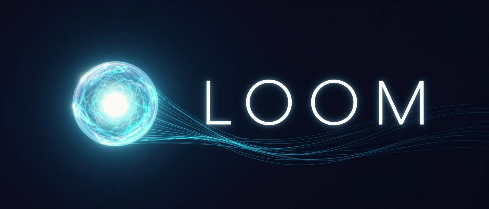
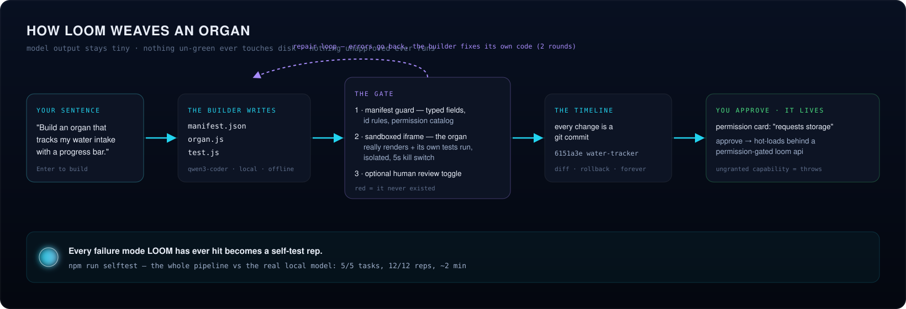
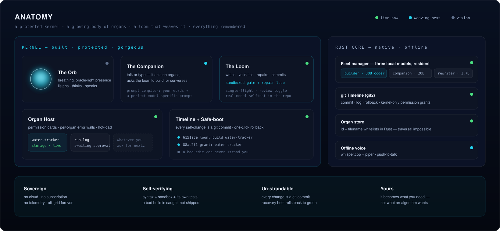

<div align="center">



### the sovereign loom

<em>offline &nbsp;·&nbsp; local models &nbsp;·&nbsp; it builds itself &nbsp;·&nbsp; it rebuilds itself &nbsp;·&nbsp; yours</em>

&nbsp;


<a href="LICENSE"></a>

<br/>


&nbsp;

<a href="#what-this-is"><kbd> &nbsp; <b>What this is</b> &nbsp; </kbd></a> &nbsp;
<a href="#what-has-shipped"><kbd> &nbsp; <b>What has shipped</b> &nbsp; </kbd></a> &nbsp;
<a href="#how-it-weaves"><kbd> &nbsp; <b>How it weaves</b> &nbsp; </kbd></a> &nbsp;
<a href="#anatomy"><kbd> &nbsp; <b>Anatomy</b> &nbsp; </kbd></a> &nbsp;
<a href="#the-fleet"><kbd> &nbsp; <b>The fleet</b> &nbsp; </kbd></a> &nbsp;
<a href="#quickstart"><kbd> &nbsp; <b>Quickstart</b> &nbsp; </kbd></a> &nbsp;
<a href="#roadmap"><kbd> &nbsp; <b>Roadmap</b> &nbsp; </kbd></a>

</div>

---

## What this is

A *loom* weaves loose thread into cloth. To *loom* is also to rise into view — a presence gathering on the horizon. **LOOM is both: a computer that weaves itself into being, and grows into a presence you live beside.**

You describe a capability in one sentence and press Enter. LOOM's local model plans it, writes the code **and its tests**, proves the whole thing inside a sandbox, repairs its own failures, commits the result to a git timeline, and asks your permission before the new organ runs — **fully offline, no cloud, no subscription, versioned so nothing is ever lost.** The grid goes down and it still evolves. You own it, and it becomes whatever you need. Forever.

> *You shouldn't rent your tools from the cloud. You should own one thing that becomes whatever you need.*

This is a proven idea, generalized. Its predecessor — the Forge engine inside **EMBER**, an offline survival console — first demonstrated that a local model can build and maintain real software offline and verify its own work. LOOM makes that engine the heart, hardened at every layer that ever failed.

---

## What has shipped

LOOM was built in phases, each a working, tested, reviewed milestone. The roadmap table below is the record; this is the shape of it.

**The engine (Phases 1–6).** A Tauri v2 shell over a Rust core; a resident local model fleet; a git Timeline for everything LOOM makes. The Loom itself: a sandboxed validation gate, a three-round self-repair loop, permission-gated organs, an optional review-before-save wall, and a real-model selftest. The Companion (prompt compiler, the presence, organ editing by sentence, seed organs). The orb and the living dashboard; the `loom.ui` design kit and the glass-window desktop; fully offline whisper + piper voice with push-to-talk; threads of light, the ambient field, ignition, and a DOM-grounded builder.

**Identity (Phase 16).** The woven mark on every surface and `docs/BRAND.md`; the Tapestry — LOOM's own git, organ and build history woven live behind the orb; the Shuttle — a ⌘K palette and voice sharing one drift-proof command catalog, and "what can you do" spoken from it.

**Vigor (Phase 19).** Organs grow hands: powers declared in the manifest, carded in plain language, budgeted, revocable live, mocked deterministically in the sandbox so the builder's generated tests are grounded. After Rebirth the powers are `timeline · voice · notify · pulse`.

**Initiative (Phase 20).** LOOM proposes an organ unprompted — a local usage observer and a deterministic rules engine that fires only on earned evidence, a calm consented proposal card, rate-limited, silenceable, tombstoned. After Rebirth one archetype remains: a morning brief rooted in the timeline.

**Selfhood and Marrow (Phases 21–22).** LOOM edits its own TypeScript kernel and its own Rust core, in dev mode, behind five walls: isolated-worktree validation with real `tsc`, `vitest`, `cargo check` and `cargo test`; owner diff-approval; commit to source; recovery boot that rolls a bad edit back; and a self-protection invariant enforced in Rust — it cannot edit its own safety machinery. A pre-compile guard and a pre-`main` heal close the gap where a compile-clean core edit panics at startup.

**The Cockpit (Phases 9–15, 17 — excised in 23a).** For a stretch LOOM grew a world behind the orb: a bundled globe deck, a market terminal with its own Rust quote engine, a salience watch, an opt-in cloud builder. It was good work and none of it was the thesis — any wrapper could ship a dashboard. Phase 18 cut the exchange dock; Phase 23a cut the rest. What survived from that era is what only LOOM has: the Tapestry, the Shuttle, the organ powers, initiative, and the chrome design language. The code stays in git history.

**Rebirth (Phase 23).** The packaged LOOM rebuilds itself, offline. It carries its own **genome** — the full git history it was woven from, bundled into the app. **Threading** the loom is a one-time ceremony: LOOM finds the tools already on the machine (git · cargo · rustc · node · npm · cmake · clang · codesign), seeds the genome into its own home, vendors every crate, installs its node modules, and warms a build. That step needs the network once and says so. From then on, with the cable unplugged, a core edit travels the five walls and then a sixth: **reweave** — assets, core, stage, swap, relaunch — builds a new binary from the genome, shelves the running one as a **generation**, swaps the executable inside the bundle, and relaunches. The **warden** is the previous generation's own binary: it watches the new body's first boot and, if that boot never confirms, brings LOOM home to the last good generation and leaves an honest record. Any kept generation can be returned to from Settings or by voice. The Tapestry weaves each generation as a knot in the cloth.

Round-1 review found that the packaged app had never been built or launched on
this branch — it failed to compile, and once it compiled it died at startup on a
missing library, in dev as well. Both are fixed and verified; the app builds,
bundles, and runs. **The lesson is written into the house rhythm: build it and
launch it before calling it shipped.**

What CI proves, against fakes: tool discovery and drift, the ceremony's steps and
resumption, the swap plan as a pure enumerable list, the warden's decision table
against a faked world, the ledger never pruning a live body, the sentinel's
ownership rule, the protected set by enumeration, and that no validation argv
reaches for `npx`. Every cargo argv the code composes carries `--offline`; the
one deliberate exception is threading's `cargo vendor`, which is one of the two
steps allowed to touch the network.

**What has actually been run, and what has not.** From a clean clone on a machine
with no prior LOOM build: `npm ci`, the full test suite, `cargo test` with a cold
crate registry, `npm run tauri build`, and launching the resulting app — all
green. Everything downstream of that is unit-tested and **has not been executed
end to end by anyone.** Threading has never run against real git, npm and cargo;
no binary has ever been swapped into a bundle; the warden has never been spawned
as a process; no generation has ever been shelved, returned to, or healed. The
packaged body builds and launches; the swap, the warden and the generations
ledger are proven against mocks. Doing it for real is one ceremony: build, launch,
thread with the network on, unplug, ask for a core change, approve, reweave, and
watch LOOM come back as its next generation.

Honest residuals: threading needs the network once, and the speech archive it
fetches lands in a macOS cache LOOM does not own — if the system purges it,
offline reweaving stops until the network returns; ad-hoc re-signing may make
macOS ask for the microphone again; a generation that boots and paints is
confirmed even if it misbehaves later — boot health is the wall, and Generations
is the way back; loomhome is several gigabytes (vendor + warm build) and Settings
shows the number; the swap is macOS-only in this generation.

**Rebirth (Phase 23a).** The second excision. Four decks, the watch, the market engine, the cloud override, and every phrase, setting, power, and Rust command that served them are gone — migration-clean, tests green at every commit. One brain: the local fleet.

---

## How it weaves



The builder does not invent design — it **composes a curated design kit** (`loom.ui`): glass cards, stats, progress, lists, buttons — so every organ is born beautiful, and lives as a draggable window on the desktop.

The load-bearing idea: **the model's output stays tiny** (one file at a time, or a single edit region), and three independent walls stand between model output and your machine — the validation gate, the git timeline, and your permission. When a build fails, the errors go **back to the builder**, which fixes its own code — tests are treated as the spec, so "should not add an empty item" gets fixed in the code, not deleted from the tests.

An optional **Review code before saving** toggle adds a fourth wall: you read the three files and choose Apply or Discard before anything touches disk.

---

## Anatomy



The kernel/organ split is load-bearing: the **kernel** is built, protected, and (in v1) only edited behind a gate; **organs** are no-build modules the Loom writes and rewrites freely, each isolated behind its own error wall and permission grant. Full self-modification — LOOM editing its own kernel — is a deliberate later flip of that guardrail, not a rebuild.

---

## The fleet

Three local specialists, resident together on 64GB — no swapping, no cloud, pinned in memory. A slow or absent model times out, retries once, then falls back — it never hangs the UI.

| role | model | Ollama tag | ~RAM | why |
|---|---|---|---|---|
| **Builder** — writes LOOM's own code | Qwen3-Coder-30B-A3B | `qwen3-coder:30b-a3b-q4_K_M` | 19 GB | MoE, 3B active → fast; 256K context |
| **Companion** — the always-on presence | gpt-oss-20b | `gpt-oss:20b` | 14 GB | quick, adjustable reasoning depth |
| **Rewriter** — the prompt compiler | Qwen3-1.7B | `qwen3:1.7b` | 1.4 GB | sub-second; restructures your words for the model |

If the configured builder is missing, LOOM automatically falls back to the **best installed coder model** before anything else — it degrades, it does not stop.

**Voice** — fully offline speech, downloaded once from Settings (like pulling the fleet):

| piece | model | size |
|---|---|---|
| Ears (STT) | whisper `ggml-base.en` (Metal) | 148 MB |
| Voice: Lessac — warm, neutral (US, default) | `en_US-lessac-medium` | ~64 MB |
| Voice: Alba — calm (British) | `en_GB-alba-medium` | ~64 MB |
| Voice: LibriTTS — rich (US) | `en_US-libritts-high` | ~100 MB |

Hold the **orb** (or **Space**) to talk; release to send. Replies are spoken aloud. Audition and switch voices in the Settings organ — which, being an organ, LOOM can edit for you.

---

## First five minutes

**Prerequisites:** macOS (Apple Silicon recommended), [Node](https://nodejs.org) 20+, the [Rust toolchain](https://rustup.rs), and [Ollama](https://ollama.com). About 35 GB free for the model fleet. Voice is optional — download it from Settings after first launch.

```bash
# 1. Clone and install
git clone https://github.com/AllStreets/loom.git
cd loom && npm install

# 2. Pull the model fleet (once, ~35 GB total — do this while you explore the code)
ollama pull qwen3-coder:30b-a3b-q4_K_M   # builder: writes and repairs code
ollama pull gpt-oss:20b                  # companion: the always-on presence
ollama pull qwen3:1.7b                   # rewriter: structures your words for the model

# 3. Verify everything is wired up
npm run check      # vitest + cargo test — must be fully green

# 4. Open LOOM
npm run tauri dev
```

On first launch the companion greets you. When the fleet is ready, type or speak your first build request — *"build me a water tracker"* or *"build an organ that tracks my reading log"* — and watch LOOM plan it, write it, test it, repair it if needed, and ask your permission before anything runs. Approve the card and your new organ is alive in the desktop.

**Voice:** hold the **orb** (or press **Space**) to talk; release to send. To download voices, open Settings from the dock and use the Download button next to each voice — no account, no network call beyond the download.

---

## Quickstart (short form)

```bash
git clone https://github.com/AllStreets/loom.git
cd loom && npm install
ollama pull qwen3-coder:30b-a3b-q4_K_M && ollama pull gpt-oss:20b && ollama pull qwen3:1.7b
npm run check && npm run tauri dev
```

To package it: `npm run tauri build`, open the app, then say **"thread the loom"** (or Settings → LOOM → THREAD THE LOOM). That needs the network once. After it, unplug and say *"give yourself …"* — approve the diff, then *"reweave yourself"*, and LOOM returns as its next generation.

Type into LOOM — *"Build an organ that tracks my daily water intake with a goal and a progress bar."* — and press **Enter**. Watch it write, validate, repair if needed, and commit; approve the permission card and your new organ is alive.

---

## Roadmap

Built in phases, each a working, tested, reviewed milestone.

| phase | what | status |
|---|---|---|
| **1 · Foundation** | Tauri shell · Rust core · resident model fleet · git Timeline · CI | shipped |
| **2 · The Loom** | self-building engine: sandboxed validation · self-repair loop · permission-gated organs · review toggle · real-model selftest | **shipped** |
| **3 · Companion** | prompt compiler · the presence (text) · organ editing by sentence · seed organs | **shipped** |
| **4 · The orb + living UI** | react-three-fiber oracle-light orb · breathing motion · the living dashboard | **shipped** |
| **4.5 · The Atelier** | loom.ui design kit — organs beautiful by construction · OS desktop: glass windows + dock | **shipped** |
| **5 · Voice** | offline whisper + piper voices · hold-the-orb / Space push-to-talk · spoken replies · Settings organ | **shipped** |
| **6 · Vitality** | threads of light · ambient field · ignition · kit v2 (hero/spark/section) · DOM-grounded builder · first-run greeting | **shipped** |
| **9–15 · The Cockpit** | decks (globe · terminal · EMBER · AGORA) · salience watch · cloud-override builder · market proxy · chrome design language · ownership | excised (18, 23a) |
| **16 · Identity** | the brand system (woven mark on every surface, BRAND.md) · the Tapestry (constellation removed; LOOM's history woven live behind the orb) · the Shuttle (⌘K palette + voice sharing one drift-proof command catalog, "what can you do") | **shipped** |
| **17 · Depth** | the keyless market engine and Terminal depth | excised (23a) |
| **18 · Excision** | AGORA removed entirely (spawn subsystem, deck, settings, voice — migration-clean) · the floor folds into the Terminal as the crypto detail overlay · four decks | **shipped** |
| **19 · Vigor** | organs grow hands: real powers (after Rebirth: timeline · voice · notify · pulse) — manifest-declared, permission-carded, budgeted, revocable live, sandbox-mocked · the builder learns the power APIs with grounded tests | **shipped** |
| **20 · Initiative** | LOOM proposes organs unprompted — a local usage observer + a deterministic rules engine that only fires on earned evidence · a calm consented proposal card (weave it / not now / never) whose "weave it" flows into the normal build pipeline · rate-limited, silenceable, tombstoned | **shipped** |
| **21 · Selfhood** | LOOM edits its own TypeScript kernel behind five walls — isolated-worktree validation (real tsc + vitest) · owner diff-approval · commit to source + hot-reload · recovery boot that rolls back a bad edit · a self-protection invariant (it cannot edit its own safety machinery) | **shipped** |
| **22 · Marrow** | LOOM edits its own Rust core (dev-mode) — same five walls, `cargo check` + `cargo test` validation · honest "restart to load" (no hot-reload) · the recovery gap closed by a pre-compile guard + pre-`main` rollback so a bad core edit self-heals · self-protection extended over the whole Rust safety core + Cargo manifests | **shipped** |
| **23a · Rebirth** | the second excision — the Cockpit is cut in full (decks · watch · market · cloud · their settings, powers, phrases and Rust commands) · one brain (local) · initiative re-rooted in the timeline | **shipped** |
| **23 · Rebirth** | packaged self-rebuild, offline — the genome bundled into the app · threading (one-time tool discovery, vendor, warm build) · reweave (assets · core · stage · swap · relaunch) · generations ledger with return · the warden (the previous generation guards the next one's first boot and heals) · Settings → LOOM · reweave card · Tapestry generation knots · self-protection over the whole rebirth machinery | **shipped** |
| **later** | toolchain distribution (rustup/node inside the app) · Windows/Linux swap · Developer-ID signing · sandboxed validation · timeline-aware organs · embedding-based intent classifier · real organ isolation · KEEL · PRISM · SIGNET | vision |

Design record: [`docs/superpowers/specs`](docs/superpowers/specs) · plans: [`docs/superpowers/plans`](docs/superpowers/plans) · brand: [`docs/BRAND.md`](docs/BRAND.md) · tracked follow-ups: [`docs/FOLLOWUPS.md`](docs/FOLLOWUPS.md)

---

## Principles

- **Sovereign.** It runs on your machine, off the grid, forever. No cloud, no subscription, no telemetry, no wall.
- **Self-verifying before impressive.** Nothing goes live until it passes the manifest guard, a sandboxed render, and its own tests. A bad build is caught — then repaired — never shipped.
- **It can't strand you.** Every change is a git commit; a broken kernel boots into recovery and rolls back. You can always get home.
- **Alive, calm, yours.** A breathing, luminous presence — light that emerges from dark. It becomes what *you* need, not what an algorithm wants.

---

<div align="center">

The active flagship of four. **LOOM** builds itself · **KEEL** predicts the supply chain · **PRISM** shows where narratives diverge · **SIGNET** proves what's real.

<sub>Lineage: EMBER's Forge, generalized and hardened · design in <a href="docs/superpowers/specs">docs/superpowers/specs</a></sub>

</div>
