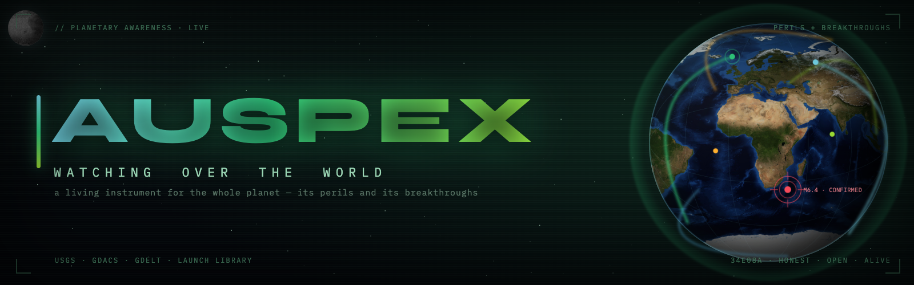

<div align="center">

<a href="https://auspex-azure.vercel.app" title="Open the live AUSPEX site"></a>

&nbsp;


<a href="LICENSE"></a>
<br/>


&nbsp;

<a href="#quickstart"><kbd> &nbsp; <b>Quickstart</b> &nbsp; </kbd></a> &nbsp;
<a href="#what-it-senses"><kbd> &nbsp; <b>What it senses</b> &nbsp; </kbd></a> &nbsp;
<a href="#three-lenses"><kbd> &nbsp; <b>The lenses</b> &nbsp; </kbd></a> &nbsp;
<a href="#architecture"><kbd> &nbsp; <b>Architecture</b> &nbsp; </kbd></a> &nbsp;
<a href="#deploy"><kbd> &nbsp; <b>Deploy</b> &nbsp; </kbd></a>

</div>

---

## What this is

The *auspex* read the sky for signs and spoke them aloud, so the city could act before the storm — not a spy, but a guardian who turned what the world was already showing into warning, in time for it to matter.

**AUSPEX is that, for the whole planet, for everyone.** A living globe where autonomous pipelines read the world's public signals — earthquakes, floods, cyclones, conflict, displacement, outbreaks — *and* its progress — launches, discoveries, medical and scientific breakthroughs — score them honestly, draw the connections between them, and render it so *anyone* can see what is actually happening. No login. No terminal. No institutional wall.

It is built against one enemy: the world sold by a doom-optimised feed. AUSPEX is calm where the world is calm, lights up where it isn't, reserves red for genuine danger, and carries the good news beside the bad.

> *The globe is the page. Red means danger. Everything else is the world, alive.*

```
  the instrument
  ├─ living globe .... NASA marble + breathing aura; red only on real peril
  ├─ 1,000 cities .... capitals (gold star), finance, tech, ports, energy …
  ├─ orbiting moon ... real-textured, on a true orbit — depth and life
  ├─ typed events .... quake·volcano·flood·cyclone·fire·launch·science…
  ├─ connections ..... real links across space + time — never invented
  ├─ honest cards .... severity · confidence · brief · sources, one tap
  └─ live map key .... a legend that derives itself from the globe
```

---

## What it senses

AUSPEX reads two halves of the same pulse. The word *auspicious* descends from *auspex* — the watcher announced **favourable** omens too — so carrying the world's breakthroughs beside its perils is the truest form of the name.

<table>
<tr>
<td valign="top" width="50%">

#### ◆ Perils
| | sensed from |
|---|---|
| earthquakes | USGS *(keyless)* |
| cyclone · flood · volcano · drought | GDACS *(keyless)* |
| conflict · unrest | news + regions |
| displacement · famine · access | news + regions |
| outbreaks · civilian harm | news signals |

</td>
<td valign="top" width="50%">

#### ◆ Breakthroughs
| | sensed from |
|---|---|
| space launches · milestones | Launch Library 2 |
| medical · physics · science | news signals |
| financial · technological | news signals |
| human progress | the *Good News* feed |

</td>
</tr>
</table>

---

## Three lenses

AUSPEX puts genuinely powerful tools in ordinary hands — three AI-powered lenses, all grounded in the same live feed and Supabase history.

<table>
<tr>
<td valign="top" width="50%">

### ANALYST
*The intelligence lens — military-grade, democratised.*

- Situation Synthesis (AI brief)
- Consensus Board (5-persona panel)
- Red Team / Adversary Playbook
- Escalation Matrix
- Dead Reckoning · Narrative Timeline
- Historical Search · Saved Boards

</td>
<td valign="top" width="50%">

### RELIEF
*The humanitarian lens — its equal, for care.*

- Situation Report · Response Council
- Needs & Gaps Matrix
- Displacement · Famine & Food-Security
- Access & Blackout · Recovery Timeline
- Health & Outbreak · Civilian Protection
- Good News — humanity's wins

</td>
</tr>
</table>

ANALYST and RELIEF are **pin-linked** — the green `PIN TO RELIEF` sits beside every `PIN TO ANALYST`. Pin any region, event, city, country, or story, change focus freely, and run the tools against deep real context: focus-relevant news, history, nearby events and their links, full region and country records.

### SECTORS
*The market lens — eight industries, every number live.*

```
┌─────────────────────┬─────────────────────┬─────────────────────┬─────────────────────┐
│ Trade & Supply      │ Finance & Markets   │ Real Estate         │ Technology & AI     │
├─────────────────────┼─────────────────────┼─────────────────────┼─────────────────────┤
│ Energy              │ Defense & Security  │ Healthcare & Pharma │ Agriculture & Food  │
└─────────────────────┴─────────────────────┴─────────────────────┴─────────────────────┘
```

Each page scores its slice of the world from live data — a **0–100 composite** (signal volume, breaking weight, AI urgency) and **1–10 per-signal** urgency — over keyless market feeds (CoinGecko · Frankfurter · World Bank · Stooq) plus the AUSPEX news layer. Four AI tools per sector — **Ask · Brief · Forecast · Scenario** — and a cross-sector coverage board. No hardcoded numbers; every figure is derived or marked an estimate.

---

## The unbiased feed

The news layer is the anti-social-media core, and it is deliberate:

- **Server-side and broad.** Reputable global RSS (BBC, Guardian, Al Jazeera, NPR, DW, France 24, UN News, ReliefWeb, science desks) as the keyless backbone, plus the GDELT firehose and optional NewsAPI — fetched server-side, deduped, cached. No per-visitor rate limit.
- **Filtered for signal.** A junk filter drops ads, PR fluff, and celebrity noise; a priority allowlist guarantees real geopolitics, economy, disaster, science, and health are never wrongly dropped.
- **Multi-source by design.** **Divergence** compares Western, Chinese, and Russian coverage of the same story; **Silence** detects information blackouts; ten **broadcasters** span all six inhabited continents. You see the spread, not one outlet's frame.

---

## Architecture

Two processes, one contract — so the public side ships **zero secrets** and a million visitors cost about the same as one.

```
   PUBLIC · keyless · edge-cached                  PRIVATE · keyed · scheduled
┌──────────────────────────────────┐           ┌──────────────────────────────────┐
│ frontend — static — :8800        │           │ worker — node/express — :8801    │
│                                  │           │                                  │
│ · living green globe             │  ◄──────  │ · USGS + GDACS ...... perils     │
│ · 1,000-city base layer          │ snapshot  │ · Launch Library 2 .. progress   │
│ · typed event icons + arcs       │   .json   │ · RSS+GDELT+NewsAPI . feed       │
│ · ANALYST · RELIEF · SECTORS     │  ◄──────  │ · reasoning engine: severity,    │
│ · honest cards · live map key    │ news.json │   confidence, links, sources     │
└──────────────────────────────────┘           └──────────────────────────────────┘
                 │                                              │
                 └─────────────────  Supabase  ─────────────────┘
               ~2,000-story history · countries · regions · ai_usage
```

The heavy work runs **once per event in the worker**, not once per visitor — and the disaster path is keyless (USGS and GDACS need no keys). That is what lets AUSPEX be free, fast on a weak connection, and honest about its sources.

---

## Quickstart

> **Prerequisites:** Node 18+ (24 recommended). Disaster sensing needs **zero** API keys. For the AI tools and keyed feeds, copy `js/keys.local.example.js` → `js/keys.local.js` (gitignored) and `worker/.env.example` → `worker/.env`. The committed `js/keys.js` is secret-free and falls back to empty keys when `js/keys.local.js` is absent (e.g. on Vercel).

```bash
git clone https://github.com/AllStreets/AUSPEX.git
cd AUSPEX && npm install
npm test                 # 134 passing — severity · normalize · filter · news · connect

cd worker && npm install && cd ..
npm run worker           # terminal 1 → worker on http://localhost:8801
npm run dev              # terminal 2 → globe  on http://localhost:8800
```

Open **http://localhost:8800**. Toggle **CITIES** for the 1,000-city layer; click any icon for an honest card; open the **MAP KEY** for the live legend, or **ANALYST · RELIEF · SECTORS** for the tool boards.

---

## Deploy

| piece | host | notes |
|---|---|---|
| frontend | static — Vercel (`vercel.json` included) | point `WORKER_BASE` at the worker URL |
| worker | container — Railway / Render / Fly (`worker/Dockerfile`) | env: `NEWS_API_KEY`, `AUSPEX_LLM_KEY`, `ALLOWED_ORIGIN` |
| database | Supabase | schema in `sql/schema.sql`; anon key is publishable, RLS-protected |
| refresh | `api/refresh` + cron | keeps the corpus fresh without traffic |

- **Always fresh.** `/news.json` and `/snapshot.json` are fetched live server-side and edge-cached ~10 min, so every visitor sees current data. To grow the Supabase corpus *independent of traffic*, `api/refresh` archives fresh stories — several times a day via `.github/workflows/refresh.yml` (GitHub Actions) plus a daily Vercel cron. Optionally lock it with `CRON_SECRET`.
- **Cost guard.** The AI tools run through `api/ai`, capping each visitor (by hashed IP) at **1M OpenAI tokens / UTC day** via an add-only, RLS-locked Supabase counter (`ai_usage`); over the cap returns `429`. Works with no extra keys and fails open if the store is briefly unreachable. Tune with `AI_DAILY_TOKEN_LIMIT`.

The public frontend ships no secrets — all keyed work lives in the worker. **AUSPEX does not go public until it is worthy of everyone in the world.** That is the bar.

---

## Principles

- **For everyone.** No login to see the planet. Readable by a child, useful to an analyst, fast on a cheap phone.
- **Honest before impressive.** Confidence and sources on every claim. Unconfirmed signals look unconfirmed.
- **A commons, not a product.** It watches events and systems — never people. A guardian's name, not a spy's.
- **Alive, calm, uncluttered.** Severity is light. Red is earned. Green is the instrument, breathing.

---

<div align="center">

One of three. **AgentZeus** watches the world *for you* · **NEXUS** runs the agents · **AUSPEX** watches the world *for everyone*.

<sub>Built on the Meridian globe platform · vision in <a href="docs/VISION.md">docs/VISION.md</a> · design record under <a href="docs/">docs/</a></sub>

</div>
