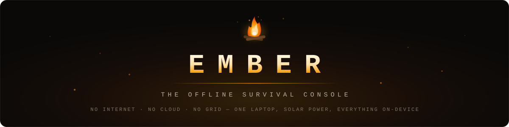
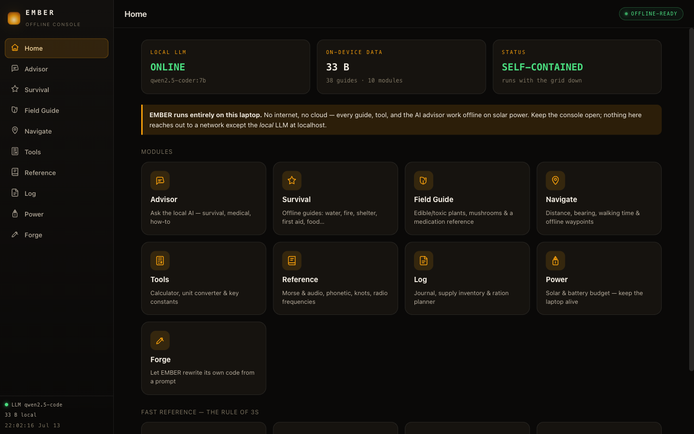
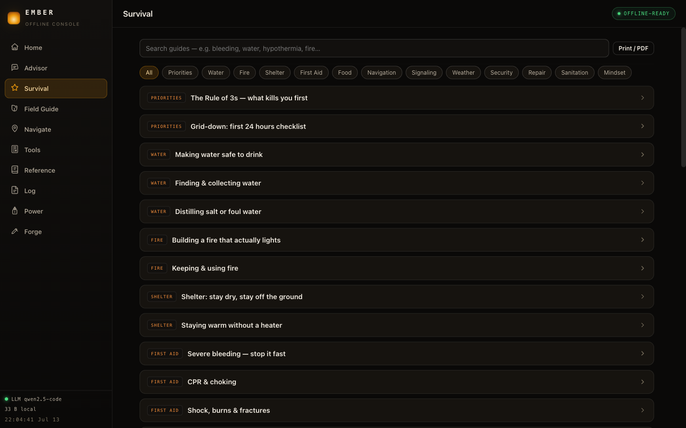
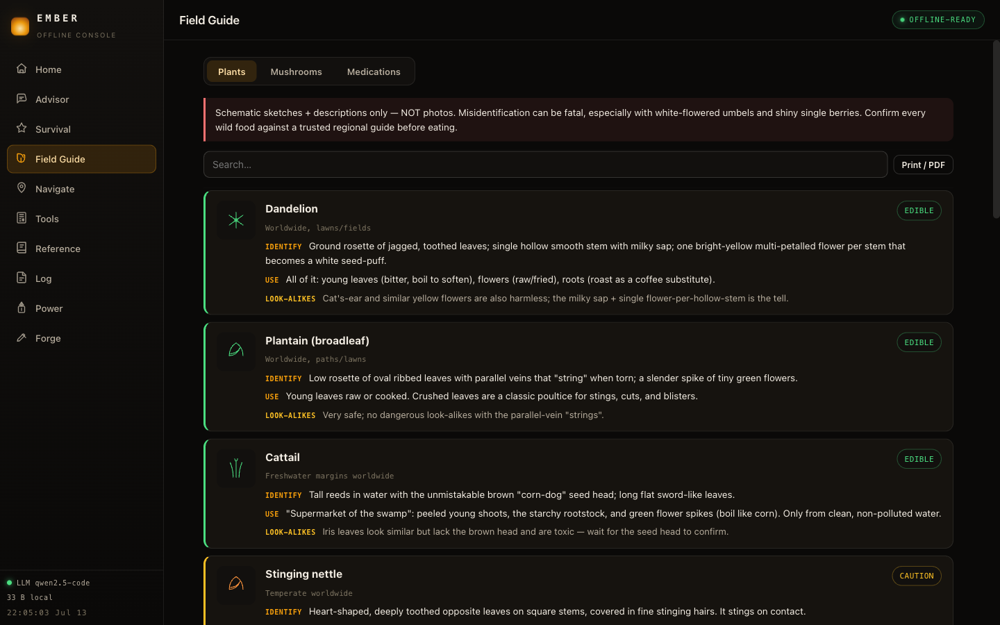
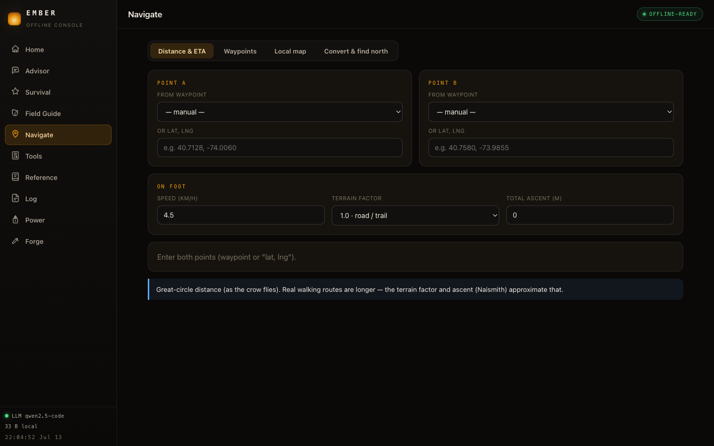
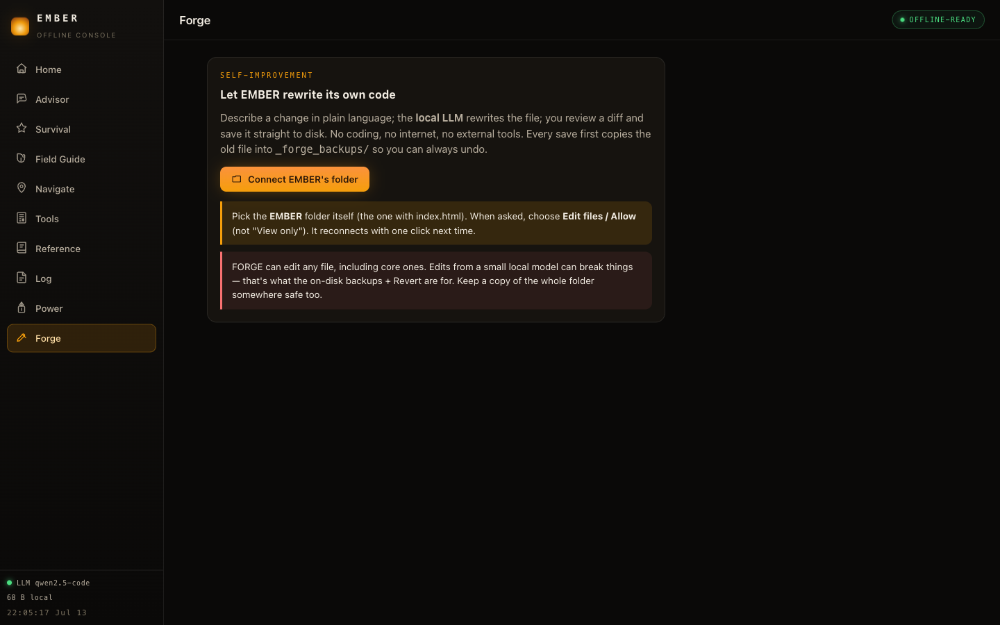

<div align="center">



&nbsp;


<a href="LICENSE"></a>
<br/>


&nbsp;

<a href="#quickstart"><kbd> &nbsp; <strong>Quickstart</strong> &nbsp; </kbd></a> &nbsp;
<a href="#the-modules"><kbd> &nbsp; <strong>Modules</strong> &nbsp; </kbd></a> &nbsp;
<a href="#the-local-ai"><kbd> &nbsp; <strong>The local AI</strong> &nbsp; </kbd></a> &nbsp;
<a href="#forge--the-console-that-rewrites-itself"><kbd> &nbsp; <strong>Forge</strong> &nbsp; </kbd></a> &nbsp;
<a href="#under-the-hood"><kbd> &nbsp; <strong>Under the hood</strong> &nbsp; </kbd></a> &nbsp;
<a href="#your-data"><kbd> &nbsp; <strong>Your data</strong> &nbsp; </kbd></a>

</div>

---

<p align="center">
  
</p>

<p align="center"><em>One laptop. Solar power. The grid is down and the network is dead — and everything still works: the guides, the tools, the maps, and the AI.</em></p>

---

## What this is

**EMBER is a survival console for the day the internet isn't there.** A single, self-contained dashboard that runs entirely on one machine: no cell service, no cloud, no CDN, no telemetry. Load it once and it caches itself; from then on it boots with the network completely dead. The only thing it ever talks to is a **local LLM at `localhost`** — model weights on your own disk, answers by firelight.

It was built against one scenario: the laptop on the table is the last computer that matters, and it's running on a solar panel. Every design decision follows from that — system fonts only, a power-frugal dark theme for OLED, zero external requests, and a knowledge base that lives in plain JavaScript files you can read with your own eyes.

> *The grid is optional. The knowledge isn't.*

```
  the console
  ├─ advisor ....... a local AI (Ollama) — first aid, repairs, math, anything
  ├─ survival ...... 38 field guides: water · fire · shelter · first aid · food …
  ├─ field guide ... edible vs toxic plants & mushrooms + medication reference
  ├─ navigate ...... bearings, Naismith walking time, waypoints, offline local maps
  ├─ tools ......... scientific calculator · unit converter · field constants
  ├─ reference ..... Morse (audible) · NATO phonetic · knots · radio frequencies
  ├─ log ........... journal · supply inventory · ration planner
  ├─ power ......... solar + battery budget — is your setup sustainable?
  └─ forge ......... EMBER rewrites its own code from a plain-language prompt
```

---

## The modules

| Module | What it does when the lights are out |
|---|---|
| **Advisor** | Chat with a local model (Ollama) about anything — triage, repairs, dosage math, navigation. Never touches the cloud. |
| **Survival** | 38 searchable guides across priorities, water, fire, shelter, first aid, food, navigation, signaling, weather, security, repair, sanitation, and mindset — each printable to PDF while you still have paper. |
| **Field Guide** | Feature-based identification of edible vs **toxic plants and mushrooms**, with danger flags and look-alike warnings, plus a common-medication reference. |
| **Navigate** | Great-circle distance, bearing, and realistic walking time (terrain factor + Naismith ascent). Saved waypoints with an offline plot, coordinate conversion, find-north methods — and a **local map** mode: load any map image or scan, calibrate two known points, then tap to read live coordinates and measure. No tiles, no internet. |
| **Tools** | Scientific calculator, unit converter, and field constants. |
| **Reference** | Morse code with an audible tone trainer, NATO phonetic alphabet, essential knots, and emergency radio frequencies. |
| **Log** | Journal, supply inventory, and a ration planner — how many days of water and food are actually left. |
| **Power** | Solar + battery budgeting: whether your panel sustains your draw, and how to stretch a charge. |
| **Forge** | The self-modification bay — see [below](#forge--the-console-that-rewrites-itself). |

<table>
<tr>
<td width="50%"></td>
<td width="50%"></td>
</tr>
<tr>
<td><em>Survival — the guides that kill you first come first.</em></td>
<td><em>Field Guide — edible vs toxic, with look-alike warnings.</em></td>
</tr>
<tr>
<td width="50%"></td>
<td width="50%"></td>
</tr>
<tr>
<td><em>Navigate — Naismith-corrected ETAs with zero map tiles.</em></td>
<td><em>Forge — describe a change, review the diff, save to disk.</em></td>
</tr>
</table>

---

## Quickstart

**Easiest (macOS):** double-click **`serve.command`**. It serves the folder at `http://localhost:8787` and opens your browser. Leave the little terminal window open.

**Any OS:**

```bash
git clone https://github.com/AllStreets/ember.git
cd ember
python3 -m http.server 8787
# open http://localhost:8787
```

Serving over `localhost` (rather than opening `index.html` as a `file://`) matters for two reasons: the service worker that makes EMBER cache itself, and the connection to the local LLM.

**After the first load it caches itself** — you can then open it again with no network at all.

---

## The local AI

> **Do this one-time setup while you still have internet.** Afterwards the AI works forever offline — the model weights live on disk.

The Advisor talks **only** to a local model on this machine, never the cloud:

1. Install **[Ollama](https://ollama.com)** — a small app that runs LLMs locally.
2. Pull a capable-but-small model (pick one):
   ```bash
   ollama pull llama3.2         # light, fast, good default
   ollama pull qwen2.5:7b       # stronger reasoning
   ollama pull gemma2:9b        # larger, if you have the RAM
   ```
3. Ollama serves at `http://localhost:11434` automatically. Reload EMBER — the sidebar LLM chip turns green.

If Ollama is running but EMBER says offline, allow the browser origin by starting Ollama with `OLLAMA_ORIGINS=*` (or add `http://localhost:8787`). You can also change the host from the Advisor's setup panel.

---

## Forge — the console that rewrites itself

EMBER edits **its own source code** from a plain-language prompt, using the same local LLM:

1. Describe a fix or a feature in plain English.
2. The local model rewrites the file; you review a proper diff.
3. Save it straight to disk (File System Access API — Chrome/Edge/Brave, folder connected once).

Every save copies the old file into **`_forge_backups/`** first, so a bad edit from a small model is always one click from recovered. A self-test harness (`forge-selftest.mjs`) exercises the pipeline. It is a survival tool in the truest sense: when there is no npm, no Stack Overflow, and no other machine, the console can still patch itself.

---

## Under the hood

```
EMBER/
├─ index.html            the shell — one page, ten modules
├─ sw.js                 service worker: cache-everything, run with the network dead
├─ js/                   one module per file — advisor, survival, navigate, forge …
│  ├─ llm.js             the only network code in the app: localhost Ollama client
│  └─ store.js           localStorage persistence, 17 lines
├─ data/                 the knowledge base — guides, field guide, reference tables
│  └─ kb.js              plain JavaScript you can read and extend by hand
├─ css/app.css           the firelight theme — system fonts, zero external assets
├─ serve.command         double-click launcher (macOS)
└─ forge-selftest.mjs    self-test harness for the Forge pipeline
```

- **No build step, no framework, no package.json.** Vanilla ES modules; the source you read is the code that runs.
- **Zero external requests.** No CDN fonts, scripts, or images — grep the source: the only host it ever contacts is `localhost`.
- **Power-frugal by design.** Warm dark theme (kind to OLED and to eyes by firelight), system font stack, no animation-heavy chrome.
- **PWA offline shell.** The service worker caches every file on first load; updates are picked up when you're back online — if you ever are.

---

## Your data

Everything you enter — chats, waypoints, journal, supplies, settings — is stored in this browser's local storage on this device. **Nothing leaves the laptop.** Clearing the browser data wipes it, so keep paper backups of anything critical.

---

## Not a substitute for training

These guides are concise reference, not professional medical, legal, or tactical advice. Where trained help exists, use it. Practice the skills before you need them.

---

<div align="center">

**MIT** © 2026 [Connor Evans](https://github.com/AllStreets) — see [LICENSE](LICENSE)

<sub>Keep the fire small. Keep it lit.</sub>

</div>
